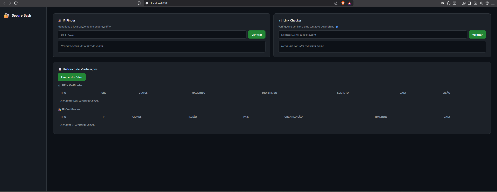
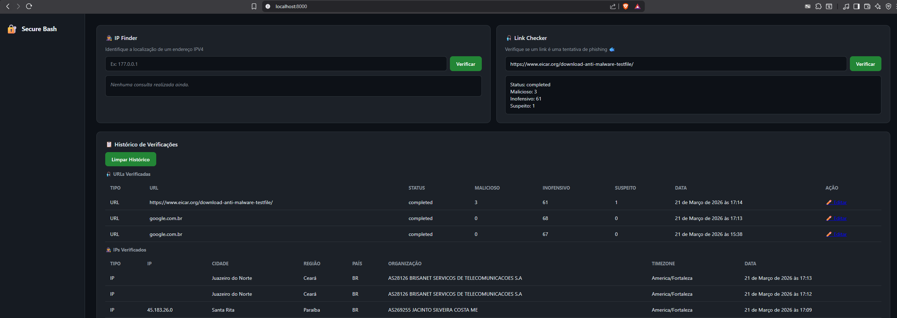
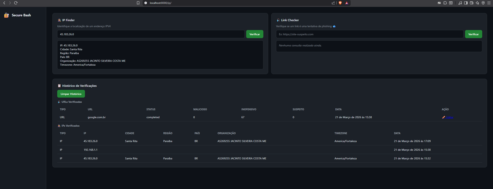

# 🔐 - SecureDash

Sistema de segurança web desenvolvido como projeto acadêmico para a Fábrica de Software 2026.1.

## 📋 Funcionalidades

- 🕵️ **IP Finder** — Identifica a localização e informações de um endereço IPv4 usando a API IPInfo
- 🎣 **Link Checker** — Verifica se uma URL é maliciosa ou phishing usando a API VirusTotal
- 📋 **Histórico de Verificações** — Armazena todas as consultas realizadas com opção de editar e limpar
- 🗄️ **Banco de dados relacional** — Duas entidades relacionadas separando consultas de URL e IP

## 🛠️ Tecnologias

- Python 3.11
- Django 6.0.3
- HTML e CSS
- PostgreSQL
- Docker
- API VirusTotal v3
- API IPInfo

## 📸 Screenshots

### Página Principal


### Link Checker


### IP Finder



## ⚙️ Como instalar e rodar

**1. Clone o repositório**
```bash
git clone https://github.com/Jonathan-atlas0/wsBackend-Fabrica26.1.git
cd wsBackend-Fabrica26.1
```

**2. Crie e ative o ambiente virtual**
```bash
python -m venv venv
venv\Scripts\activate
```

**3. Instale as dependências**
```bash
pip install -r requirements.txt
```

**4. Configure as chaves de API**

No arquivo `virustotal.py` substitua pela sua chave do VirusTotal:
```python
VIRUSTOTAL_API_KEY = 'sua_chave_aqui'
```

No arquivo `ipinfo.py` substitua pelo seu token do IPInfo:
```python
IPINFOCHAVE = 'seu_token_aqui'
```

**5. Configure o banco de dados**

No arquivo `settings.py` configure o banco de dados:
```python
DATABASES = {
    'default': {
        'ENGINE': 'django.db.backends.postgresql',
        'NAME': 'securedash',
        'USER': 'postgres',
        'PASSWORD': 'sua_senha',
        'HOST': 'localhost',  # ou 'db' se rodar com Docker Compose
        'PORT': '5432',
    }
}
```

> ⚠️ Crie o banco `securedash` no PostgreSQL antes de rodar as migrations!

**6. Rode as migrations**
```bash
python manage.py migrate
```

**7. Inicie o servidor**
```bash
python manage.py runserver

Acesse em: http://127.0.0.1:8000
```

## 🐳 Rodando com Docker**

**Opção 1 — Docker Compose (recomendado)**
```bash
docker-compose up
```
Acesse em: http://localhost:8000

**Opção 2 — Docker simples**
```bash
docker build -t securedash .
docker run -p 8000:8000 securedash
```

## 🧪 IPs e URLs para teste

| Tipo | Valor | Descrição |
|------|-------|-----------|
| IP | `1.178.29.0` | Mexico |
| IP | `1.1.1.1` | Cloudflare |
| IP | `177.66.0.1` | TIM Nordeste |
| URL | `https://www.google.com` | URL limpa |
| URL | `http://testsafebrowsing.appspot.com/s/phishing.html` | URL de phishing (teste) |
| URL | `http://testsafebrowsing.appspot.com/s/malware.html` | URL de malware (teste) |

## 🔑 APIs utilizadas

| API | Uso | Link |
|-----|-----|------|
| VirusTotal | Verificação de URLs maliciosas | [virustotal.com](https://www.virustotal.com) |
| IPInfo | Localização de endereços IP | [ipinfo.io](https://ipinfo.io) |

## 🔗 Endpoints

| Método | Endpoint | Descrição |
|--------|----------|-----------|
| GET/POST | `/` | Página principal e verificação de URL via VirusTotal |
| POST | `/ip/` | Consulta de localização de IP via IPInfo |
| POST | `/limpar/` | Limpa todo o histórico de verificações |
| GET/POST | `/editar/<id>/` | Edita um registro do histórico |

## 🤖 Uso de Inteligência Artificial

A IA foi utilizada para:

- Sugerir boas práticas de organização de código Django
- Ajudar na configuração do Docker e Docker Compose
- Revisar e melhorar o CSS e o HTML
- Escrever e melhorar a documentação do projeto

## 👨‍💻 Autor

Desenvolvido por **Jonathan Santos** — Fábrica de Software 2026.1